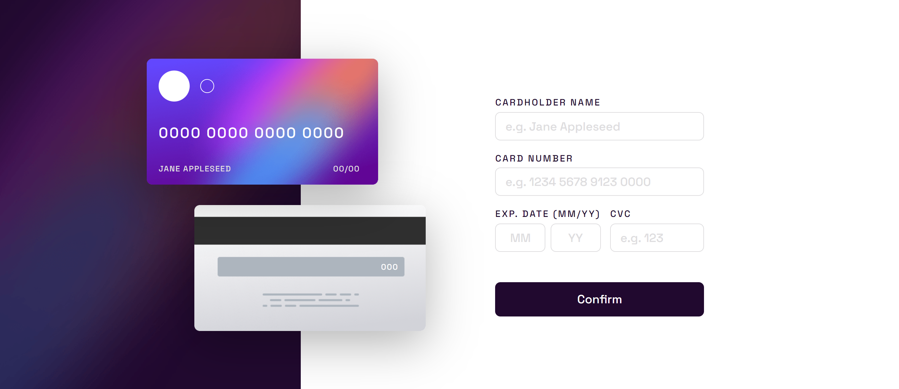

# Formulário com cartão interativo
Solução para criar uma página de formulário com cartão interativo em HTML, CSS e JavaScript, responsivo para mobile e desktop.

## Índice

- [Visão geral](#visao-geral)
  - [O Desafio](#o-desafio)
  - [Screenshot](#screenshot)
- [Minha caminhada](#minha-caminhada)
  - [Propriedades](#propriedades)
  - [O que aprendi](#o-que-aprendi)
  - [Recursos](#recursos)
- [Autor](#autor)

## Visão Geral

### O Desafio

Os usuários devem ser capazes de:

- Visualizar o layout ideal para o site, dependendo do tamanho da tela do dispositivo, mobile (375px) ou desktop (1440px)
- Visualizar os estados de foco para todos os elementos interativos na página

### Screenshots

<html>
<h4>Layout mobile</h4>
    
<!--
    <h4>Menu mobile</h4>
    
    <h4>Modal de projetos</h4>
    
    <h4>Modal de agradecimento</h4>
    
    <h4>Layout desktop</h4>
    
    <h4>Modal de agradecimento</h4>
    
-->
</html>

## Minha caminhada

- [x] Preparativos do layout com mobile-first 
- [x] Cards header
- [ ] Form
- [ ] Form complete state
- [ ] Mobile layout
- [ ] Desktop layout
- [ ] Estado de foco dos elementos
- [ ] JS functions

### Propriedades

- Mobile-first
- Semântica HTML
- CSS BEM
- CSS Flexbox
- CSS Grid
- CSS Reaproveitável, limpo e flexível

### Meu aprendizado
...

Trechos de destaque:

HTML
```html
...

...
```
CSS
```css

```
JavaScript
```javascript

```

### Recursos

- [CSS - Blocos, Elementos e Modificadores](https://getbem.com/introduction/) - Este é um artigo que vai te fazer entender a boa prática, para nomear as suas classes.

- [O desafio da Frontend Mentor](https://www.frontendmentor.io/challenges/interactive-card-details-form-XpS8cKZDWw) - Neste link você encontrará o desafio solucionado aqui.

## Autor

- LinkedIn - [Pedro A. Lima](https://www.linkedin.com/in/pedrolima626/)
