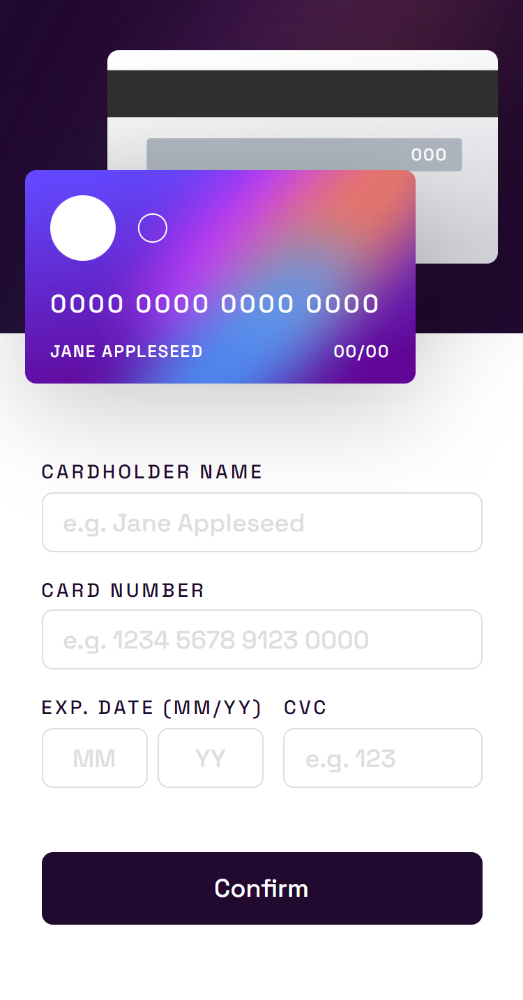

# Formulário de cartão de crédito
Solução para criar um formulário de cartão de crédito que ao ser preenchido mostra em tempo real os dados na imagem do cartão.

## Índice

- [Visão geral](#visao-geral)
  - [O Desafio](#o-desafio)
  - [Screenshot](#screenshot)
- [Minha caminhada](#minha-caminhada)
  - [Propriedades](#propriedades)
  - [O que aprendi](#o-que-aprendi)
  - [Recursos](#recursos)
- [Autor](#autor)

## Visão Geral

### O Desafio

Os usuários devem ser capazes de:

- Preencher o formulário e ver a atualização dos dados do cartão em tempo real

- Receber mensagens de erro quando o formulário for enviado se:

    * Qualquer campo de entrada estiver vazio

    * O número do cartão, a data de validade ou os campos CVC estão no formato errado

- Visualizar o layout ideal dependendo do tamanho da tela do dispositivo (mobile e desktop)

### Screenshots

<html>
    <h4>Layout mobile</h4>
    
    <h4>Layout mobile com dados em branco</h4>
    
    <h4>Layout mobile com formulário completo</h4>
    
    <h4>Layout desktop </h4>
    
    <h4>Layout desktop com dados em branco</h4>
    
    <h4>Layout desktop com formulário completo</h4>
    
</html>

## Minha caminhada

- [x] Preparativos do layout com mobile-first 
- [x] Layout mobile
- [x] Feature do nome do cartão, número do cartão, data (mês e ano) e CVC
- [x] Feature de submit
- [x] Layout desktop


### Propriedades

- Mobile-first
- Semântica HTML
- CSS BEM
- CSS Flexbox
- JavaScript DOM manipulation
- JavaScript data flow

### Meu aprendizado
Ao elaborar a feature das mensagens de erro quando qualquer input estiver em branco, surgiu a necessidade de estruturar um fluxo de dados condicional com "if", que me auxiliou na verificação dos valores vazios de cada elemento, onde se verdadeiro, retorna a mensagem "o campo não pode estar vazio", se falso, envia o formulário. Essa prática me fez consolidar o conhecimento das suas propriedades e aspectos.

Trechos de destaque:

HTML
```html
...
<input type="text" id="cardNameInput" placeholder="e.g. Jane Appleseed" maxlength="16">
...
<input type="text" id="cardNumberInput" placeholder="e.g. 1234 5678 9123 0000" maxlength="16">
...
<input type="text" id="monthInput" placeholder="MM" maxlength="2">
...
<input type="text" id="yearsInput" placeholder="YY" maxlength="2">
...
<input type="text" placeholder="e.g. 123" id="cvcInput" maxlength="3">
...
```
JavaScript
```javascript
// Função que verifica os valores dos inputs
function checkInputs() {
   const cardNameInputValue = cardNameInput.value;
   const cardNumberInputValue = cardNumberInput.value;
   const monthInputValue = monthInput.value;
   const cvcInputValue = cvcInput.value;
   // Fluxo de dados que verifica se os inputs estão vazios, caso contrario envia o formulário
   if (!cardNameInputValue) {
    setErrorFor(cardNameInput, "can't be blank");
    } 
    else if (!cardNumberInputValue) {
        setErrorFor(cardNumberInput, "can't be blank");
    } 
    else if (!monthInputValue) {
        setErrorFor(monthInput, "can't be blank");
    } 
    else if (!cvcInputValue) {
        setErrorFor(cvcInput, "can't be blank");
    } 
    else {
    alternationForms();
    }
};
```

### Recursos

- [Link do site](https://formul-rio-com-cart-o-interativo.vercel.app/) - Veja como ficou o resultado desse projeto!!!

- [JavaScript - HTML Event Attributes](https://www.w3schools.com/tags/ref_eventattributes.asp) - Este é um artigo que vai te mostrar todos os eventos, como os que existem em formulários, teclas, mouse e etc.

- [O desafio da Frontend Mentor](https://www.frontendmentor.io/challenges/interactive-card-details-form-XpS8cKZDWw) - Neste link você encontrará o desafio solucionado aqui.

## Autor

- LinkedIn - [Pedro A. Lima](https://www.linkedin.com/in/pedrolima626/)
